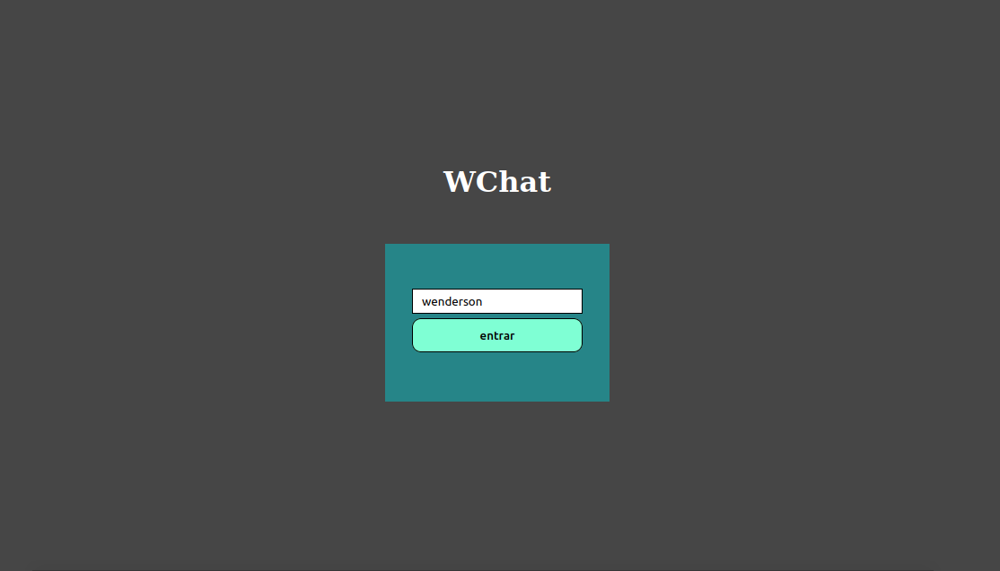
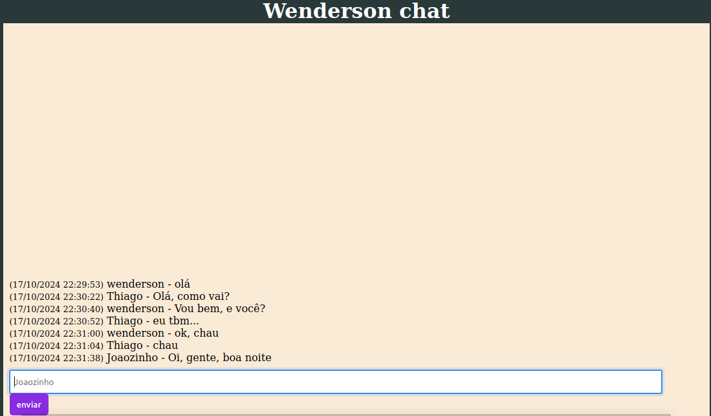

# WChat

Chat feito com Nodejs e Socket.io

### Clone o repositório:
git clone https://github.com/seu-usuario/nome-da-aplicacao.git

### Instale as dependências:
npm install

### Inicie a aplicação:
npm start

### Acesse a aplicação no seu navegador:
http://localhost:3000

# Fotos:

